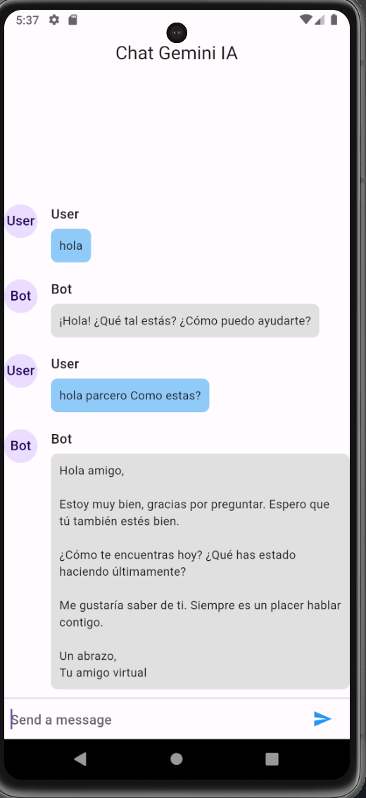
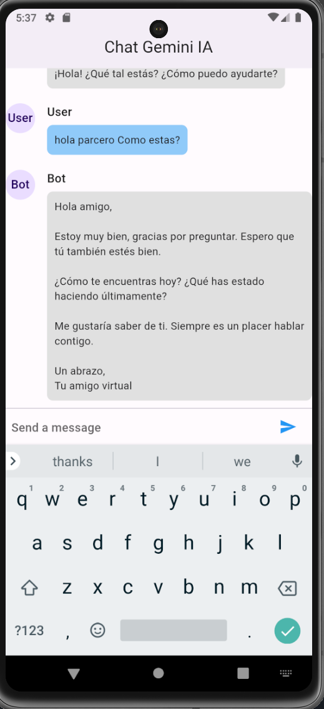

# chat_gemini

A new Flutter project.

Este es un ejemplo de uso de la api de IA de Google llamada Gemini. Hacemos uso de la biblioteca dio para hacer peticiones a una API que nos contesta los mensajes enviados.

DEMO
[APK for Android](build/app/outputs/flutter-apk/app-release.apk)

